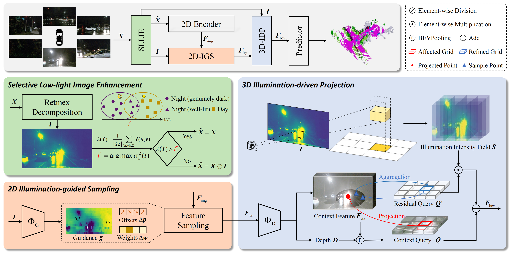

<p align="center">
<h2 align="center"> Accepted to NeurIPS 2025! </h2>
<h2 align="center"> See through the Dark: Learning Illumination-affined Representations<br>for Nighttime Occupancy Prediction  </h2>

<p align="center">
  <a href="https://arxiv.org/abs/2505.20641">
    
  </a>
</p>
  
<p align="center">
<a href="https://rayn-wu.github.io/">Yuan Wu</a><sup>1*</sup>, 
<a href="https://yanzq95.github.io/">Zhiqiang Yan</a><sup>2*</sup>, 
Yigong Zhang</a><sup>3&dagger;</sup>, 
<a href="https://implus.github.io/">Xiang Li</a><sup>3</sup>, 
<a href="https://scholar.google.com/citations?user=6CIDtZQAAAAJ&hl=zh-CN">Jian Yang</a><sup>1&dagger;</sup>
</p>


<p align="center">
  <sup>&ast;</sup>equal contribution&nbsp;&nbsp;&nbsp;
  <sup>&dagger;</sup>corresponding author&nbsp;&nbsp;&nbsp;<br>
  <sup>1</sup>Nanjing University of Science and Technology&nbsp;&nbsp;&nbsp;
  <sup>2</sup>National University of Singapore&nbsp;&nbsp;&nbsp;
  <sup>3</sup>Nankai University&nbsp;&nbsp;&nbsp;
</p>



## 🚀 Get Started

### Installation and Data Preparation

Step1. Prepare environment as that in [Install](doc/install.md).

Step2. Prepare nuscenes and generate pkl file by runing：

```python
python tools/create_data_bevdet.py
```

The final directory structure for 'data' folder is like

```shell
└── data
  └── nuscenes
      ├── v1.0-trainval
      ├── maps  
      ├── sweeps  
      ├── samples
      ├── gts
      ├── bevdetv2-nuscenes_infos_train.pkl 
      └── bevdetv2-nuscenes_infos_val.pkl
```
### Train & Evaluate

```shell
# train:
tools/dist_train.sh ${config} ${num_gpu}

# test:
tools/dist_test.sh ${config} ${ckpt} ${num_gpu} --eval mAP
```

## 💾 Model weights

The pretrained weights in 'ckpt' folder can be found [here](https://drive.google.com/drive/folders/1BFm4URLMj06O0H7T_9QDauX_7dAoRkXX?usp=drive_link). All model weights can be found [here](https://drive.google.com/drive/folders/1yuPtZylYFgHQD3G7lyqCNh6v61QbJRdu?usp=sharing).

## 🙏 Acknowledgements

This project builds upon several outstanding open-source projects. We sincerely thank the authors of:
- [BEVDet](https://github.com/HuangJunJie2017/BEVDet),  [FlashOcc](https://github.com/Yzichen/FlashOCC),  [FB-BEV](https://github.com/NVlabs/FB-BEV), [SCI](https://github.com/vis-opt-group/SCI), [Occ3D](https://github.com/Tsinghua-MARS-Lab/Occ3D), [RoboBEV](https://github.com/worldbench/robobev)


## 📝 Citation

If our method proves to be of any assistance, please consider citing:
```
@article{wu2025see,
  title={See through the Dark: Learning Illumination-affined Representations for Nighttime Occupancy Prediction},
  author={Wu, Yuan and Yan, Zhiqiang and Zhang, Yigong and Li, Xiang and Yang, Jian},
  journal={arXiv preprint arXiv:2505.20641},
  year={2025}
}
```
